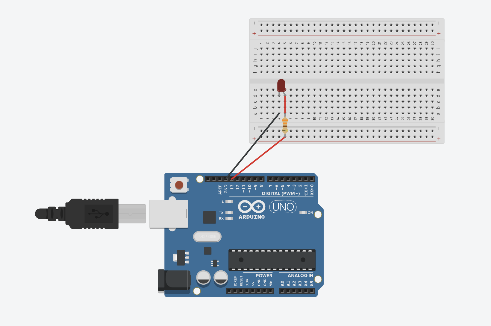

# Ponderada de Programação - Módulo 4

Este repositório contém a resposta à atividade da Ponderada de Programação do Módulo 4 do primeiro ano do Inteli.

**Autor:** Gabriel Willian Bartmanovicz

A resposta da parte 1 está no arquivo está dentro da pasta `parte1/`.

Para a parte 2, a seguir está o circuito desenvolvido no TinkerCAD:

A seguir o link para o projeto: https://www.tinkercad.com/things/ltQjySAvF24-ponderada-modulo-4-semana-1?sharecode=_AqyYkJFQj5jvsMo2sLzR_1ILPBPPnfVEmozhrc8Lxs

O código desenvolvido para o Arduino está disponível no arquivo `parte2/main.ino`.
